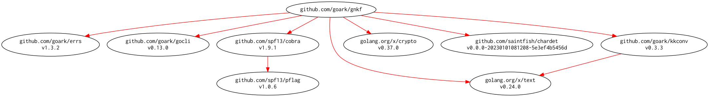

# [gnkf] -- Network Kanji Filter by Golang

[](https://github.com/spiegel-im-spiegel/gnkf/actions)
[](https://github.com/spiegel-im-spiegel/gnkf/actions)
[](https://raw.githubusercontent.com/spiegel-im-spiegel/gnkf/master/LICENSE)
[](https://github.com/spiegel-im-spiegel/gnkf/releases/latest)

This package is required Go 1.16 or later.

## Download and Build

```
$ go get github.com/spiegel-im-spiegel/gnkf@latest
```

### Binaries

See [latest release](https://github.com/spiegel-im-spiegel/gnkf/releases/latest).

## Usage

```
$ gnkf -h
Network Kanji Filter by Golang

Usage:
  gnkf [flags]
  gnkf [command]

Available Commands:
  base64      Encode/Decode BASE64
  dump        Hexadecimal view of octet data stream
  enc         Convert character encoding of the text
  guess       Guess character encoding of the text
  help        Help about any command
  kana        Convert kana characters in the text
  newline     Convert newline form in the text
  norm        Unicode normalization of the text
  remove-bom  Remove BOM character in UTF-8 string
  version     Print the version number
  width       Convert character width in the text

Flags:
      --debug   for debug
  -h, --help    help for gnkf

Use "gnkf [command] --help" for more information about a command.
```

### gnkf guess command

```
$ gnkf guess -h
Guess character encoding of the text

Usage:
  gnkf guess [flags]

Aliases:
  guess, g

Flags:
      --all           print all guesses
  -f, --file string   path of input text file
  -h, --help          help for guess

Global Flags:
      --debug   for debug

$ echo こんにちは，世界 | gnkf guess --all
UTF-8
windows-1255
windows-1253
Big5
GB-18030
Shift_JIS
```

### gnkf enc command

```
$ gnkf enc -h
Convert character encoding of the text.
 Using MIME and IANA name as the character encoding name.
 Refer: http://www.iana.org/assignments/character-sets/character-sets.xhtml

Usage:
  gnkf enc [flags]

Aliases:
  enc, encoding, e

Flags:
  -d, --dst-encoding string   character encoding name of output text (default "utf-8")
  -f, --file string           path of input text file
  -g, --guess                 guess character encoding of source text
  -h, --help                  help for enc
  -o, --output string         path of output file
  -b, --remove-bom            remove BOM character in source text (UTF-8 only)
  -s, --src-encoding string   character encoding name of source text (default "utf-8")

Global Flags:
      --debug   for debug

$ echo こんにちは，世界 | gnkf enc -g -d shift_jis | gnkf dump 
0x82, 0xb1, 0x82, 0xf1, 0x82, 0xc9, 0x82, 0xbf, 0x82, 0xcd, 0x81, 0x43, 0x90, 0xa2, 0x8a, 0x45, 0x0a
```

### gnkf newline command

```
$ gnkf newline -h
Convert newline form in the text.

Usage:
  gnkf newline [flags]

Aliases:
  newline, nwln, nl

Flags:
  -f, --file string           path of input text file
  -h, --help                  help for newline
  -n, --newline-form string   newline form: [lf|cr|crlf] (default "lf")
  -o, --output string         path of output file

Global Flags:
      --debug   for debug

$ echo こんにちは，世界 | gnkf newline -n crlf | gnkf dump --unicode
0x3053, 0x3093, 0x306b, 0x3061, 0x306f, 0xff0c, 0x4e16, 0x754c, 0x000d, 0x000a
```

### gnkf norm command

```
$ gnkf norm -h
Unicode normalization of the text (UTF-8 encoding only).

Usage:
  gnkf norm [flags]

Aliases:
  norm, normalize, nrm, nm

Flags:
  -f, --file string        path of input text file
  -h, --help               help for norm
  -k, --kangxi-radicals    normalize kangxi radicals only (with nfkc or nfkd form)
  -n, --norm-form string   Unicode normalization form: [nfc|nfd|nfkc|nfkd] (default "nfc")
  -o, --output string      path of output file
  -b, --remove-bom         remove BOM character

Global Flags:
      --debug   for debug

$ echo ﾍﾟﾝｷﾞﾝ | gnkf norm -n nfkc | gnkf dump --unicode
0x30da, 0x30f3, 0x30ae, 0x30f3, 0x000a
```

#### Normalize Kangxi Radicals

```
$ echo ㈱埼⽟ | gnkf dump --unicode
0x3231, 0x57fc, 0x2f5f, 0x000a

$ echo ㈱埼⽟ | gnkf norm -n nfkc -k | gnkf dump --unicode
0x3231, 0x57fc, 0x7389, 0x000a
```

### gnkf width command

```
$ gnkf width -h
Convert character width in the text (UTF-8 encoding only).

Usage:
  gnkf width [flags]

Aliases:
  width, wdth, w

Flags:
  -c, --conversion-form string   conversion form: [fold|narrow|widen] (default "fold")
  -f, --file string              path of input text file
  -h, --help                     help for width
  -o, --output string            path of output file
  -b, --remove-bom               remove BOM character

Global Flags:
      --debug   for debug

$ echo ペンギン | gnkf width -c narrow | gnkf dump --unicode
0xff8d, 0xff9f, 0xff9d, 0xff77, 0xff9e, 0xff9d, 0x000a
```

### gnkf kana command

```
$ gnkf kana -h
Convert kana characters in the text.
 UTF-8 encoding only.
 "hiragana" and "katakana" forms are valid only for full-width kana character.

Usage:
  gnkf kana [flags]

Aliases:
  kana, k

Flags:
  -c, --conversion-form string   conversion form: [hiragana|katakana|chokuon] (default "katakana")
  -f, --file string              path of input text file
      --fold                     convert character width by fold form
  -h, --help                     help for kana
  -o, --output string            path of output file
  -b, --remove-bom               remove BOM character

Global Flags:
      --debug   for debug

$ echo こんにちは | gnkf kana -c katakana
コンニチハ
```

#### Convert 直音 (Chokuon; Upper kana characters)

```
$ echo ニッポン | gnkf kana -c chokuon
ニツポン
```

### gnkf base64 command

```
$ gnkf base64 -h
Encode/Decode BASE64.

Usage:
  gnkf base64 [flags]

Aliases:
  base64, b64

Flags:
  -d, --decode          decode BASE64 string
  -f, --file string     path of input text file
  -u, --for-url         encoding/decoding defined in RFC 4648
  -h, --help            help for base64
  -p, --no-padding      no padding
  -o, --output string   path of output file

Global Flags:
      --debug   for debug

$ echo Hello World | gnkf b64
SGVsbG8gV29ybGQK

$ echo SGVsbG8gV29ybGQK | gnkf b64 -d
Hello World
```

### gnkf remove-bom command

```
$ gnkf remove-bom -h
Remove BOM character in UTF-8 string.

Usage:
  gnkf remove-bom [flags]

Aliases:
  remove-bom, rbom, rb

Flags:
  -f, --file string     path of input text file
  -h, --help            help for remove-bom
  -o, --output string   path of output file

Global Flags:
      --debug   for debug

$ echo Hello | gnkf dump
0xef, 0xbb, 0xbf, 0x48, 0x65, 0x6c, 0x6c, 0x6f, 0x0a

$ echo Hello | gnkf remove-bom | gnkf dump
0x48, 0x65, 0x6c, 0x6c, 0x6f, 0x0a
```

### gnkf dump command

```
$ gnkf dump -h
Hexadecimal view of octet data stream with C language array style.

Usage:
  gnkf dump [flags]

Aliases:
  dump, hexdump, d, hd

Flags:
  -f, --file string   path of input text file
  -h, --help          help for dump
  -u, --unicode       print by Unicode code point (UTF-8 only)

Global Flags:
      --debug   for debug

$ echo ペンギン | gnkf dump
0xe3, 0x83, 0x9a, 0xe3, 0x83, 0xb3, 0xe3, 0x82, 0xae, 0xe3, 0x83, 0xb3, 0x0a

$ echo ペンギン | gnkf dump --unicode
0x30da, 0x30f3, 0x30ae, 0x30f3, 0x000a
```

## Modules Requirement Graph

[](./dependency.png)

[gnkf]: https://github.com/spiegel-im-spiegel/gnkf "spiegel-im-spiegel/gnkf: Network Kanji Filter by Golang"
